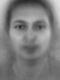
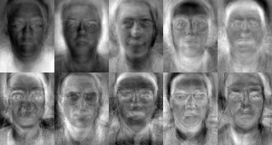
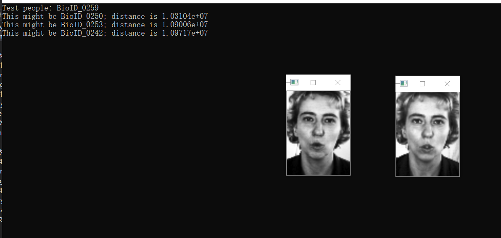
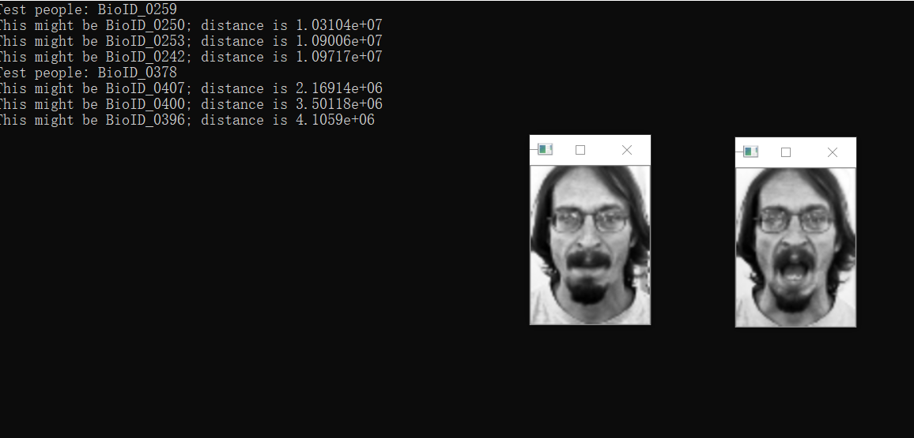
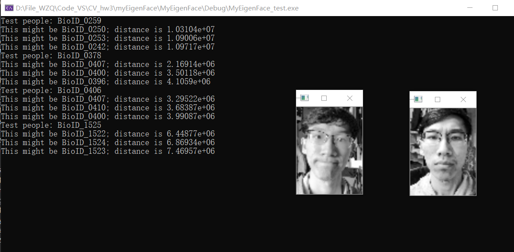
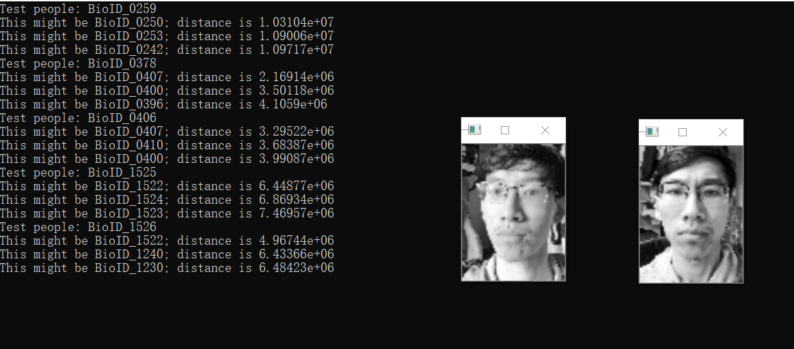

# 浙江大学实验报告

专业：计算机科学与技术

姓名：XXX

学号：XXX

日期：2020/12/27

课程名称：计算机视觉

指导老师：XXX

实验名称：HW3：EigenFace人脸识别


## 实验环境以及运行方式

**程序使用OpenCV3.4版本，x86版本，C++实现，VS2019的工程文件。**

**使用数据集BioID-FaceDatabase-V1.2**。

可执行文件位于./MyEigenFace/Debug目录下，MyEigenFace_test.exe以及MyEigenFace_train.exe

两个程序的输入格式分别为：

1. **MyEigenFace_train.exe <*能量百分比>* <*model文件名> <执行模式>*；**

   在要求的输入格式上，增加了**执行模式**这一变量，可以取值的范围为0-3；

   分别代表**预处理训练集，预处理测试集，训练模型，以及全部执行**四种模式；

2. **MyEigenFace_test.exe <*人脸图像文件名> <model文件名> <相似人脸个数>***

   在要求的基础上增加了相似人脸个数这一参数，表示程序会识别出多少个与输入相似的人脸；

   其中只有最接近的一张人脸会被显示，其他人脸的编号会显示在终端上，同时给出计算得到的欧氏距离，由小到大排序。

**NOTICE**：本程序的训练集需要花费较长时间进行训练，本工程提供的训练数据集在本人电脑上一共训练了4小时。

**运行程序时，请保证./Data文件夹内的数据不要轻易移动。**

./Data文件夹内的有如下子目录：

FaceDataBase_pretreat：经过预处理的训练数据集

model：存储模型的文件夹，如需重新训练，请删除其中的文件，但是要保留./model/face文件夹

RecgFace：储存等待识别的图像数据（里面的图像必须经过预处理），

RecgFace_tmp：储存所有经过预处理的测试集数据，您可以将该文件夹内，需要进行识别的文件移动到RecgFace内。


## 1.实验目的和要求

自己写代码实现 Eigenface 人脸识别的训练与识别过程：

1. 假设每张人脸图像只有一张人脸，且两只眼睛位置已知（即可人工标注给出）。每张图像的眼睛位置存在相应目录下的一个与图像文件名相同但后缀名为 txt 的文本文件里，文本文件中用一行、以空格分隔的4个数字表示，分别对应于两只眼睛中心在图像中的位置；

2. 实现两个程序过程（两个执行文件），分别对应训练与识别；

3. 自己构建一个人脸库（至少 40 人，包括自己），课程主页提供一个人脸库可选用；

4. 不能直接调用 OpenCV 里面与 Eigenface 相关的一些函数，特征值与特征向量求解函数可以调用；只能用 C/C++/Python，不能用其他编程语言；GUI只能用 OpenCV 自带的 HighGUI，不能用QT或其他的；平台可以用 Win/Linux/MacOS，建议 Win 优先；

5. 训练程序格式大致为：“mytrain.exe <*能量百分比>* <*model文件名> <其他参数>*…”，用能量百分比决定取多少个特征脸，将训练结果输出保存到 model 文件中。同时将前 10 个特征脸拼成一张图像，然后显示出来；

6. 识别程序格式大致为：“mytest.exe <*人脸图像文件名> <model文件名> <其他参数>*…”，将 model 文件装载进来后，对输入的人脸图像进行识别，并将识别结果叠加在输入的人脸图像上显示出来，同时显示人脸库中跟该人脸图像最相似的图像。


## 2.实验内容和原理

+ PCA的原理以及求解过程；

+ eigenFace的算法步骤：

  1.获得人脸图像的训练集，通常为整个人脸数据库；

  2.对所有人脸图像作归一化处理；

  3.通过**PCA**计算获得一组特征向量**(**特征脸**)**。通常一百个特征向量就足够；

  4.将每幅人脸图像都投影到由该组特征脸张成的子空间中，得到在该子空间坐标；

  5.对输入的一幅待测图像，归一化后，将其映射到特征脸子空间中。然后用某种距离度量来描述两幅人脸图像的相似性，如欧氏距离。


## 3.实验步骤与分析

### 3.1 程序结构

训练程序与识别程序分为两个项目`MyEigenFace_train`与`MyEigenFace_test`；

两个项目中均实现了两个类`FaceLibrary`与`PreTreat`，二者在两个项目内的实现是相同的，两个项目的唯一区别在于主函数不同。

`PreTreat`类中封装着与图像预处理相关的函数

`FaceLibrary`类中封装着关于整个eigenFace算法相关的函数，从读取数据，训练模型，到存储模型，识别人脸。

下面将首先介绍两个类的实现，然后再说明两个项目（程序）的不同。

### 3.2 `PreTreat`类

图像预处理的过程如下：

1. 读取数据集中的图像(.pgm)以及对应的眼睛位置文件（.eye），其中.eye文件格式如下：

   ```
   #LX	LY	RX	RY
   232	110	161	110
   ```

   .eye文件的内容将被存储在数据结构`Eye`中，其中distance表示两眼间距。

   ```c++
   typedef struct Eye
   {
   	int LX;
   	int LY;
   	int RX;
   	int RY;
   	double distance;
   }Eye;
   ```

2. 根据眼间距distance与mask的大小，计算二者比例并对原图像进行放缩。

   mask以openCV数据结构`Rect`表示，在类中定义了私有成员`Rect ROI;`，在类初始化时初始化大小。

   mask中的眼间距为mask宽度的1/3，根据对应的比例放缩图像后，再计算出放缩后的图像眼睛位置，根据眼睛位置将mask放置于合适的位置，然后裁剪图像，获取到大小统一的人脸图像。

   以下为放缩圆图像的代码，完整代码详见工程文件。

   ```c++
   pos_eye.distance = sqrt(pow(pos_eye.LX - pos_eye.RX, 2) + pow(pos_eye.LY - pos_eye.RY, 2));
   double ROIdistance = ROI.width * 1.0 / 3;
   double ratio = ROIdistance / pos_eye.distance;
   Mat img_resize;
   resize(img, img_resize, Size(img.cols * ratio, img.rows * ratio), 0, 0, CV_INTER_LINEAR);
   ```

3. 最终将处理后的数据存储在对应位置即可。

**补充说明**：

1. 预处理通过函数`void PreTreat::Interface(int mode)`调用，其中mode为1表示对训练数据进行预处理，mode为0表示对测试数据进行预处理。二者的不同之处在于会处理不同的图片，并存储在不同的目录地址下。

2. 由于本程序通过自己独立实现PCA算法，算法过程缺少优化，导致输入规模很大时运算速度极慢，因此在训练程序中只能训练有限数量的图片，且mask的大小要尽可能小，故数据集并不会全部读取，而是选择其中的一部分，因此预处理程序也只会预处理其中的一部分，预处理的训练数据选择编号为11的倍数的数据，预处理的测试数据选择编号为7倍数的数据，在程序中体现如下。

```c++
if (isTrain)
{
    increment = 11;
}
else
{
    increment = 7;
}
for (int i = 0; i < NumImg; i += increment)
{
    //预处理程序
    ……
}
```

3. 确定Mask的位置后Mask可能超出图像的范围，这部分数据将直接舍弃,不放入预处理后的数据文件夹。

```c++
if (ROI.x + ROI.width > img_resize.cols || ROI.y + ROI.height > img_resize.rows)
{
    printf("CORP ERROR:img:%d\n", i);
    continue;
}
```


### 3.3 `FaceLibrary`类

`FaceLibrary`类中的函数可以分为两部分，训练部分与识别部分

#### 3.3.1 训练

##### 3.3.1.1 读取训练图像

`void FaceLibrary::loadFace(string input)`用于读取（经过预处理后的）训练集的人脸数据，并将这些图像数据存储在成员`vector<Face*>face;`中。

其中`Face`定义如下：name储存文件名（指代特定人脸），data存储图像数据，eigen表示图像数据在特征空间上的投影，这一变量仅在识别程序中会被初始化，此处暂时不会。

```c++
struct Face
{
	char* name;
	CvMat* data;
	CvMat* eigen;
};
```

##### 3.3.1.2 计算平均脸与协方差矩阵

通过函数`cvCalcCovarMatrix()`可以计算由所有图像数据组成的矩阵的协方差矩阵，同时得到均值；

函数`void FaceLibrary::getMeanFace(string input)`的主要任务就是围绕`cvCalcCovarMatrix()`进行相应的矩阵转换和数据结构转化，首先获取由所有图像数据组成的矩阵（每一行表示一个图像中的所有数据），计算得到结果后，协方差矩阵存储在`covarCvMat `中，而将`meanCvMat`（1行，row*col列的矩阵）转为图像矩阵的表示方式（row行，col列的矩阵），输出平均脸并保存。

核心代码如下，其他代码均围绕这一函数展开，详见工程文件。

```c++
cvCalcCovarMatrix((const CvArr**)image_points, number, covarCvMat, meanCvMat, CV_COVAR_NORMAL | CV_COVAR_ROWS);
```

##### 3.3.1.3 计算特征脸

特征向量矩阵以及特征值的计算可以通过函数`cvEigenVV`完成。

得到特征向量矩阵后，将其中前10个特征向量以图像格式表示出来，转为一个2*5的图像方阵显示。

转化过程如下:

```c++
for (int t1 = 0; t1 < 2; t1++)
{
    for (int t2 = 0; t2 < 5; t2++)
    {
        CvMat* img_mat = cvCreateMat(row, col, CV_64FC1);
        for (int i = 0; i < row; i++)
            for (int j = 0; j < col; j++)
                CV_MAT_ELEM(*img_mat, double, i, j) = CV_MAT_ELEM(*eigenVector, double, t1 * 5 + t2, i * col + j);
        cvNormalize(img_mat, img_mat, 255.0, 0.0, CV_MINMAX);
        CvSize s;
        s.height = row;
        s.width = col;
        IplImage* img = cvCreateImage(s, 8, 1);
        cvConvert(img_mat, img);
        cvSetImageROI(dstImg, cvRect(t2 * col, t1 * row, col, row));
        cvCopy(img, dstImg);
        cvResetImageROI(dstImg);
    }
}
```

**特别说明：**`cvEigenVV`的计算是本工程中最耗时的过程，在较大输入下会非常消耗时间，而输入如果再大一些会因为没有连续内存空间而产生内存分配的错误，因此本工程不得不将mask的大小调小，并减少读取的数据集。

##### 3.3.1.4 储存模型以及相关数据

`void FaceLibrary::saveModel(string input, int energyNum)`函数完成对模型所需的数据的存储，主要是如下几个部分：

1. `energyNum`个特征脸的图像数据（.pgm）;
2. `energyNum`个特征向量组成的矩形(A.xml);
3. 数据集中每张脸在特征空间中的投影（face文件夹内的.xml文件）


#### 3.3.2 识别

##### 3.3.2.1 载入模型

需要载入的数据包括：

1. `energyNum`个特征向量组成的矩形(A.xml);
2. 数据集中每张脸在特征空间中的投影（face文件夹内的.xml文件）
3. 数据集中的每个人脸（face文件夹内的.pgm文件）

##### 3.3.2.2 读取待识别的人脸

读取待识别的目录下的人脸，储存在数据结构` rec_face`中

##### 3.3.2.3 识别人脸

对于每一个待识别的人脸，首先计算待识别的人脸在特征空间内的投影,将结果储存在结构体rec_face的eigen成员中。

```c++
CvMat* rec = cvCreateMat(row * col, 1, CV_64FC1);
for (int i = 0; i < row; i++)
    for (int j = 0; j < col; j++)
        CV_MAT_ELEM(*rec, double, i * col + j, 0) = CV_MAT_ELEM(*rec_face[t]->data, double, i, j);
rec_face[t]->eigen = cvCreateMat(eigen_number, 1, CV_64FC1);
cvMatMul(At, rec, rec_face[t]->eigen);
```

接下来，依次比较待识别的人脸的投影与数据集内其他人脸的投影的欧氏距离；

通过`cvNorm()`可以完成这一计算，其中第三个参数选取为`CV_L2`；

接下来就是一个排序问题，其中`double min[200];`按照顺序储存了待识别人脸与数据集人脸的欧氏距离（由小到大）；

`min_index[200]`则按照顺序储存了距离最近的数据集人脸的编号（由小到大）

```c++
double min[200];
int min_index[200];
for (int i = 0; i < recn; i++)
{
    min[i] = cvNorm(face[i]->eigen, rec_face[t]->eigen, CV_L2);
    min_index[i] = i;
}
for (int i = recn; i < face.size(); i++) {
    double dis = cvNorm(face[i]->eigen, rec_face[t]->eigen, CV_L2);
    if (dis < min[recn - 1]) {
        for (int j = 0; j < recn; j++) {
            if (dis < min[j]) {
                for (int k = recn - 1; k > j; k--)
                {
                    min[k] = min[k - 1];
                    min_index[k] = min_index[k - 1];
                }
                min[j] = dis;
                min_index[j] = i;
                j = recn;
            }
        }
    }
}
cout << "Test people: " << rec_face[t]->name << endl;
for (int i = 0; i < recn; i++)
    cout << "This might be " << face[min_index[i]]->name << "; distance is " << min[i] << endl;
```

最终输出最接近的人脸图片即可（由于我们选取的mask较小，这里的图片也会较小，故简单将其放大一些）。


### 3.4 训练程序

训练程序的主函数，只需要按照输入调用上述两个类中的相关函数即可。

训练程序的输入格式为XXX.exe <*能量百分比>* <*model文件名> <执行模型>*；

在要求的输入格式上，增加了执行模式这一变量，可以取值的范围为0-3；

分别代表预处理训练集，预处理测试集，训练模型，以及全部执行四种模式；

相关代码如下：

```c++
//预处理训练集
if (mode == 0) 
{
    preTreat.Interface(0);
}
//预处理测试集
else if (mode == 1)
{
    preTreat.Interface(1);
}
//训练
else if (mode == 2)
{
    char* load_src = new char[100];
    sprintf(load_src, "%s/FaceDataBase_pretreat", folder);
    char* model_src = new char[100];
    sprintf(model_src, "%s/model", folder);
    library.loadFace(load_src);
    library.getMeanFace(folder);
    library.getEigen(folder);
    library.saveModel(model_src, energy);
}
//全部进行
else if (mode == 3)
{
    preTreat.Interface(0);
    preTreat.Interface(1);

    char* load_src = new char[100];
    sprintf(load_src, "%s/FaceDataBase_pretreat", folder);
    char* model_src = new char[100];
    sprintf(model_src, "%s/model", folder);
    library.loadFace(load_src);
    library.getMeanFace(folder);
    library.getEigen(folder);
    library.saveModel(model_src, energy);
}
else
{
    cout << "Invaid mode!" << endl;
}
```

### 3.5 测试程序

测试程序输入格式为：XXX.exe <*人脸图像文件名> <model文件名> <相似人脸个数>*

在要求的基础上增加了相似人脸个数这一参数，表示程序会识别出多少个与输入相似的人脸；

其中只有最接近的一张人脸会被显示，其他人脸的编号会显示在终端上，同时给出计算得到的欧氏距离，由小到大排序。

需要注意的是，**进行测试之前，请手动将预处理获取的训练集照片移动到./model/face文件夹内**。以确保测试程序读取数据集中的人脸

```c++
int main(int argc, char* argv[]) 
{

	FaceLibrary facelibrary;

	if (argc != 4) {
		printf("Parameter Invalid\n");
		return -1;
	}
	//facenum决定识别出多少个相似的对象
	int facenum = atoi(argv[3]);

	facelibrary.loadModel(argv[2]);
	facelibrary.loadRecFace(argv[1]);
	facelibrary.recFace(facenum);
}
```


## 4.实验结果

执行训练程序，获取到如下平均脸：



获取到10张特征脸：



执行识别程序，选取一些测试集图片进行输入（包括自己的人脸），输出如下：

其中左侧的脸为输入的脸，右侧为识别出对应的最为接近的人脸，终端中输出了三个最为接近的人脸的编号以及相应的欧氏距离：






以下为自己的人脸作为输入：





## 5.心得体会

本次实验的代码量相较前两次有明显的提升，而且需要对整个算法的原理有更为深入的理解，因此花费了很多时间来查阅相关资料，并理解关于EigenFace的实现原理。怀疑可能会是CV所有作业中最耗时的一项了。


除了关于PCA以及EigenFace的理解之外，在本次实验中还对OpenCV的数据结构有了进一步的认识，主要是关于三种常用的表示图像的数据结构：`CvMat`,`Mat`以及`IplImage`。

早期OpenCV版本中经常使用`CvMat`以及`IplImage`来储存图像数据，不过二者各有所长，`CvMat`表示的实际上是一般的矩阵，适合进行各种矩阵相关的运算，而`IplImage`更多用于表示图像（读写）。而在OpenCV3之后，OpenCV倾向于用`Mat`数据结构来取代前两者，`Mat`兼有两种数据结构的功能，而且更方便进行管理，由于前两种数据结构并不会自动释放内存，容易产生内存泄漏的问题。

关于三种数据结构之间的相互转换，查询到一篇博文说得较为详细：https://www.cnblogs.com/summerRQ/articles/2406109.html


同时注意到OpenCV在每次创建`Mat`数据结构时，初始化函数中经常有类似于`CV_64FC1`格式的宏定义，以前使用时一直未注意过其中的含义，但是注意到如果这个宏设置地不对时，会出现各种意外地错误，这次对这一类宏进行了一定地了解：

这一类宏均可表示为`CV_[bite](U|S|F)C[channels] `，是创建图像数据结构时，定义的图像类型，以CV_为开头，随后的两位数字表示这是一个多少位的图像，例如`CV_64FC1`表示64位图像；随后一位为U，S，F中的一位，分别代表无符号整型，有符号整型，浮点型，表示二进制编码的类型，在C后的一位则表示图像是几通道的，例如灰度图表示为1通道，RGB为3通道，RGBA为4通道。

故而初始化图像数据结构时需要注意这一参数的设置，否则不同类型图像之间传递数据时可能出现错误。


此外，本次实验中涉及了非常多的OpenCV的各种计算用的函数：

`cvCalcCovarMatrix()`用于计算协方差矩阵；

`cvNormalize`对图像数据进行归一化；

`cvNorm`根据参数类型求取两个向量之间的范数；

`cvEigenVV`计算特征向量以及特征值；

在本实验中，最后一个函数的计算尤其耗时，即使使用较小的mask（80*60），对于200多组图像的输入，这一计算还是消耗了4、5个小时（不过通过任务管理器发现这一进程没有占用太多CPU资源）。听一位同学说使用python代码完成本实验，如果PCA相关的计算直接调用sklearn的函数的话，对于1k多组数据的输入只需要数秒时间。此时深刻理解到矩阵运算的加速实属计算机领域一重大进步Orz。