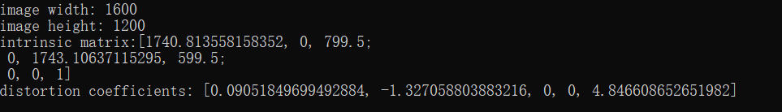
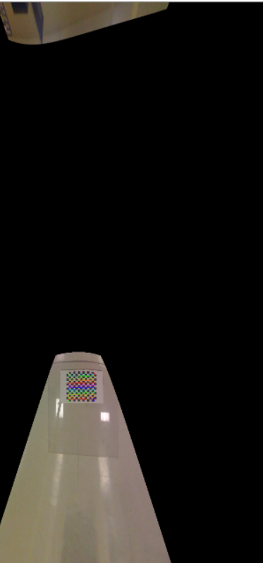

# 浙江大学实验报告

专业：计算机科学与技术

姓名：XXX

学号：XXX

日期：2020/12/30

课程名称：计算机视觉

指导老师：XXX

实验名称：HW4：相机定标与鸟瞰图变换


## 实验环境以及运行方式

**程序使用OpenCV3.4版本，x86版本，C++实现，VS2019的工程文件。**

程序执行的输入为：XXX.exe <1board_width>  <2board_height> <3number_of_boards> <4ms_delay_framee_capture> <5image_scaling_factor>  <6path_to_calibration_images <7path/chessboard_image>

参数1表示棋盘格纵向的角点数量；参数2表示棋盘格横向的角点数量；

参数3表示棋盘格的照片数量；参数4表示标定阶段获取到棋盘格角点后，显示图像的时长（单位为ms，建议取100）；

参数5表示部分显示图像的放缩比（建议取0.6）；参数6表示相机标定图像所在的文件夹（文件夹最后以/结尾）；

参数7表示转化为鸟瞰图的图像的文件名（带路径）；


## 1.实验目的和要求

1. 参考Learning OpenCV示例18-1，利用棋盘格图像进行相机定标，将参数写入xml文件保存。棋盘格图像见群文件Learning OpenCV/LearningOpenCV_Code/LearningOpenCV_Code/calibration

2. 参考示例19-1，根据求得的内参实现鸟瞰图（俯视）转换，测试图片见群文件LearningOpenCV/LearningOpenCV_Code/LearningOpenCV_Code/birdseye


## 2.实验内容和原理

1. 相机模型：关于相机内参以及外参的定义；
2. 畸变参数，径向畸变与切向畸变的产生原因以及计算公式；
3. 相机定标原理；


## 3.实验步骤与分析

整个程序分为两个部分，以下就相机定标部分和鸟瞰图转换部分的算法过程进行一一介绍：

在这里先介绍程序的步骤，**具体函数的原理将在心得与讨论中详细说明**。

### 3.1 相机定标

1. 读取棋盘格图像：

   首先通过自定义函数`readFilenames`获取文件夹内所有文件的文件名，依次对文件夹内的每个文件图像，读取文件并检测非空；

2. 棋盘格角点检测：

   继续处理文件夹内的每个图像，首先根据输入的参数挑战图像大小，随后通过`findChessboardCorners`获取图像中的棋盘格角点，并在图像中画出：

```c++
image_size = image0.size();
cv::resize(image0, image, cv::Size(), image_sf, image_sf, cv::INTER_LINEAR);

// Find the board
//
vector<cv::Point2f> corners;
bool found = cv::findChessboardCorners(image, board_sz, corners);

// Draw it
//
drawChessboardCorners(image, board_sz, corners, found);  // will draw only if found
```

​		如果检测出角点，参数中的`found`将为`true`，则将该数据传入容器中		以供后续进行相机标定时使用。

```c++
 if (found) {
     image ^= cv::Scalar::all(255);
     cv::Mat mcorners(corners);

     // do not copy the data
     mcorners *= (1.0 / image_sf);

     // scale the corner coordinates
     image_points.push_back(corners);
     object_points.push_back(vector<cv::Point3f>());
     vector<cv::Point3f>& opts = object_points.back();

     opts.resize(board_n);
     for (int j = 0; j < board_n; j++) {
         opts[j] = cv::Point3f(static_cast<float>(j / board_w),
                               static_cast<float>(j % board_w), 0.0f);
     }
     cout << "Collected " << static_cast<int>(image_points.size())
         << "total boards. This one from chessboard image #"
         << i << ", " << folder + filenames[i] << endl;
 }
```

3. 计算内参，畸变参数，并保存：

   内参的计算通过函数`calibrateCamera`完成，通过这一计算我们将得到相机的内参矩阵`intrinsic_matrix`以及畸变参数`distortion_coeffs`。这二者将在去畸变中被使用。计算结束后，将这二者以xml的格式进行保存。

   ```c++
   double err = cv::calibrateCamera(
       object_points, image_points, image_size, intrinsic_matrix,
       distortion_coeffs, cv::noArray(), cv::noArray(),
       cv::CALIB_ZERO_TANGENT_DIST | cv::CALIB_FIX_PRINCIPAL_POINT);
   ```

4. 图像去畸变并输出：

   首先通过`initUndistortRectifyMap`，从之前的内参以及畸变参数中计算得出两个transformation map，这两个map以Mat格式存储，将用于随后对每个图像进行去畸变的计算。

   ```c++
   cv::Mat map1, map2;
   cv::initUndistortRectifyMap(intrinsic_matrix_loaded, distortion_coeffs_loaded,
                               cv::Mat(), intrinsic_matrix_loaded, image_size,
                               CV_16SC2, map1, map2);
   ```

   随后，对每个图像使用函数`remap`，可以获取到去畸变后的图像，并将其输出。

   ```c++
   for (size_t i = 0; (i < filenames.size()) && (board_count < n_boards); ++i) {
       cv::Mat image, image0 = cv::imread(folder + filenames[i]);
       ++board_count;
       if (!image0.data) {  // protect against no file
           cerr << folder + filenames[i] << ", file #" << i << ", is not an image" << endl;
           continue;
       }
       // Just run the camera to the screen, now showing the raw and
       // the undistorted image.
       //
       cv::remap(image0, image, map1, map2, cv::INTER_LINEAR,
                 cv::BORDER_CONSTANT, cv::Scalar());
       cv::imshow("Original", image0);
       cv::imshow("Undistorted", image);
       if ((cv::waitKey(0) & 255) == 27) {
           break;
       }
   }
   ```

   

### 3.2 鸟瞰图转换

1. 读取待转换图像，相机内参于畸变参数，去畸变；

   读取储存着内参以及畸变参数的.xml文件，提取出其中的内参以及畸变参数，随后读取需要进行视角转换的图像；

   去畸变通过`undistort`可以直接完成；

   ```c++
   cv::undistort(image0, image, intrinsic, distortion, intrinsic);
   ```

2. 检测棋盘格角点，进一步优化至亚像素级别，并绘制角点；

   除了调用函数`findChessboardCorners`来获取图像角点之外，这里还调用了函数`cornerSubPix`来获取亚像素级别的角点，它以之前获取的角点作为输入之一，以获取到更为精确的角点。

   ```c++
   vector<cv::Point2f> corners;
   bool found = cv::findChessboardCorners( // True if found
       image,                              // Input image
       board_sz,                           // Pattern size
       corners,                            // Results
       cv::CALIB_CB_ADAPTIVE_THRESH | cv::CALIB_CB_FILTER_QUADS);
   if (!found) {
       cout << "Couldn't acquire checkerboard on " << argv[4] << ", only found "
           << corners.size() << " of " << board_n << " corners\n";
       exit(-1);
   }
   
   // Get Subpixel accuracy on those corners
   //
   cv::cornerSubPix(
       gray_image,       // Input image
       corners,          // Initial guesses, also output
       cv::Size(11, 11), // Search window size
       cv::Size(-1, -1), // Zero zone (in this case, don't use)
       cv::TermCriteria(cv::TermCriteria::EPS | cv::TermCriteria::COUNT, 30,
                        0.1));
   ```

   获取到精确的角点后，将其在图像中绘制出来；

   ```c++
   // DRAW THE POINTS in order: B,G,R,YELLOW
   //
   cv::circle(image, imgPts[0], 9, cv::Scalar(255, 0, 0), 3);
   cv::circle(image, imgPts[1], 9, cv::Scalar(0, 255, 0), 3);
   cv::circle(image, imgPts[2], 9, cv::Scalar(0, 0, 255), 3);
   cv::circle(image, imgPts[3], 9, cv::Scalar(0, 255, 255), 3);
   
   // DRAW THE FOUND CHECKERBOARD
   //
   cv::drawChessboardCorners(image, board_sz, corners, found);
   cv::imshow("Checkers", image);
   ```

3. 选取好新的投影平面后，重新计算投影矩阵，将当前的投影平面转换到新的投影平面上；

   ```c++
   cv::Mat H = cv::getPerspectiveTransform(objPts, imgPts);
   ```

   `getPerspectiveTransform`将得到从初始平面到目标平面的变换矩阵，随后，通过将这一矩阵作为函数`warpPerspective`的输入之一，可以将目标图像的视角从原先的投影平面上改变到目标平面。

   ```c++
    cv::warpPerspective(image,			// Source image
                        birds_image, 	// Output image
                        H,              // Transformation matrix
                        image.size(),   // Size for output image
                        cv::WARP_INVERSE_MAP | cv::INTER_LINEAR,
                        cv::BORDER_CONSTANT, cv::Scalar::all(0) // Fill border with black
                       );
   ```

   为了手动控制鸟瞰点的高度，可以通过键盘输入修改变换矩阵中影响重投影后高度值的值。

4. 根据键盘输入改变投影矩阵，重新投影，不断重复3-4直接到键盘输入结束符；

   为了手动控制鸟瞰点的高度，可以通过键盘输入修改变换矩阵H中影响重投影后高度值的值。

   ```c++
   for (;;) {
       // escape key stops
       H.at<double>(2, 2) = Z;
       // USE HOMOGRAPHY TO REMAP THE VIEW
       //
       cv::warpPerspective(image,			// Source image
                           birds_image, 	// Output image
                           H,              // Transformation matrix
                           image.size(),   // Size for output image
                           cv::WARP_INVERSE_MAP | cv::INTER_LINEAR,
                           cv::BORDER_CONSTANT, cv::Scalar::all(0) // Fill border with black
                          );
   
   
       cv::Mat Mat_resize;
       cv::resize(birds_image, Mat_resize, cv::Size(), image_sf, image_sf, cv::INTER_LINEAR);
   
       cv::imshow("Birds_Eye", Mat_resize);
       int key = cv::waitKey() & 255;
       if (key == 'u')
           Z += 0.5;
       if (key == 'd')
           Z -= 0.5;
       if (key == 27)
           break;
   }
   ```

   

## 4.实验结果

相机角点检测过程截图：


相机定标结果：内参结果以及distortion计算结果：



鸟瞰图转换效果：




## 5.心得体会与讨论

本次实验中设计到诸多函数的使用，其中有很多说明的细节。

### 5.1 关于棋盘格角点检测与绘制

棋盘格角点检测函数如下：

```c++
int cvFindChessboardCorners( const void* image, CvSize pattern_size, CvPoint2D32f* corners, int* corner_count=NULL, int flags=CV_CALIB_CB_ADAPTIVE_THRESH );
```

函数的返回值表示是否检测到完整的棋盘格角点，只有检测到所有的角点（同`pattern_size`所示)时才会返回1。

返回的角点通常以`vector<cv::Point2f>`格式存储。

而最后一个参数可以设置如下：

- CV_CALIB_CB_ADAPTIVE_THRESH -使用自适应阈值（通过平均图像亮度计算得到）将图像转换为黑白图，而不是一个固定的阈值。

- CV_CALIB_CB_NORMALIZE_IMAGE -在利用固定阈值或者自适应的阈值进行二值化之前，先使用cvNormalizeHist来均衡化图像亮度。

- CV_CALIB_CB_FILTER_QUADS -使用其他的准则（如轮廓面积，周长，方形形状）来去除在轮廓检测阶段检测到的错误方块。

棋盘格的角点绘制函数如下：

```c++
void cv::drawChessboardCorners(
		cv::InputOutputArray image, 
		cv::Size patternSize, 
		cv::InputArray corners, 
		bool patternWasFound 
	);
```

通常与`cvFindChessboardCorners`结合使用，因为它的第四个参数就是该函数的输出。而一个参数即是输入也是输出，标记的角点会显示在该图像上。

### 5.2 相机标定函数

相机标定函数的调用方式如下：

```c++
double calibrateCamera(InputArrayOfArrays objectPoints, 
                       InputArrayOfArrays imagePoints,
                       Size imageSize, 
                       InputOutputArray cameraMatrix, 
                       InputOutputArray distCoeffs, 
                       OutputArrayOfArrays rvecs, 
                       OutputArrayOfArrays tvecs, 
                       int flags=0)
```

前两个参数代表世界坐标系中的棋盘角点以及图像坐标系中的棋盘角点，一个参数类型为`vector<vector<Point3f>> objectPoints`,表示三维点集，第二个参数类型为`vector<vector<Point2f>> objectPoints`表示二维点集。

`rvecs`与`tvecs`表示旋转向量与位移向量，二者共同用于将棋盘格所在的物体坐标系转换到相机坐标系内。

`flags`表示标定时所采用的算法，其取值可以为特定的多种宏的组合，其可能的取值较多，这里仅介绍本程序所采用的两种。

+ CV_CALIB_FIX_PRINCIPAL_POINT：在进行优化时会固定光轴点。当CV_CALIB_USE_INTRINSIC_GUESS参数被设置，光轴点将保持在中心或者某个输入的值。
+ CV_CALIB_ZERO_TANGENT_DIST：设定切向畸变参数（p1,p2）为零。

### 5.3 去畸变的相关函数

理论上在拥有了畸变参数以及内参后，就可以对相机图像进行去畸变。本程序中用到如下相关函数。

```c++
CV_EXPORTS_W void initUndistortRectifyMap( InputArray cameraMatrix, InputArray distCoeffs,
                                          InputArray R, InputArray newCameraMatrix,
                                          Size size, int m1type, OutputArray map1, OutputArray map2 );
```

这一函数的参数`R` 表示一个3*3的修正矩阵，在单目相机标定时可以设为空，函数会将其视作一个单位矩阵。而`newCameraMatrix`在单目相机标定中一般也设置得与`cameraMatrix`一致。

这一函数返回两个映射，表示从带畸变图像向无畸变图像转换时所用到得映射。

这一函数要结合`remap`函数一起使用，该函数得最后两个参数分别表示边界模式以及边界颜色。

```c++
oid remap( InputArray src, OutputArray dst,
          InputArray map1, InputArray map2,
          int interpolation, int borderMode=BORDER_CONSTANT,
          const Scalar& borderValue=Scalar());
```

上述两个函数也可以通过一个函数来实现，即`undistort`，其内部实现也就是调用了上述两个函数。

```c++
void undistort( InputArray src,
               OutputArray dst,
               InputArray cameraMatrix,
               InputArray distCoeffs,
               InputArray newCameraMatrix=noArray() );
```

### 5.4 亚像素级角点检测

在鸟瞰图转换中不仅使用了角点检测的函数，还进一步使用`cornerSubPix`来进行亚像素级别的角点检测。

直观上说，亚像素级的检测能获取更为精确的结果，特别是在角点较为刁钻的情况下。

函数的输入如下，可以看出在进行该函数之前首先要进行棋盘格的角检测，并将角点检测的输出作为该函数的输入，同时该函数的检测结果也会体现在`corners`这一输入上。

```c++
void cv::cornerSubPix(
    cv::InputArray image, // 输入图像
    cv::InputOutputArray corners, // 角点（既作为输入也作为输出）
    cv::Size winSize, // 区域大小为 NXN; N=(winSize*2+1)
    cv::Size zeroZone, // 类似于winSize，但是总具有较小的范围，Size(-1,-1)表示忽略
    cv::TermCriteria criteria // 停止优化的标准
);
```

第五个参数用于表示计算亚像素时停止迭代的标准，可选的值有cv::TermCriteria::MAX_ITER 、cv::TermCriteria::EPS（可以是两者其一，或两者均选），前者表示迭代次数达到了最大次数时停止，后者表示角点位置变化的最小值已经达到最小时停止迭代。二者均使用cv::TermCriteria()构造函数进行指定。

### 5.5 视角转换

视角转换本质上是投影矩阵的变换，因此在程序上，首先需要获取到完成这一变换的矩阵（将成像投影到一个新的平面的操作称为投影映射(Projective Mapping)），随后再利用这一矩阵进行投影映射。

这两部分的操作分别由如下两个函数完成：

```c++
Mat cv::getPerspectiveTransform	(	InputArray 	src,
                                    InputArray 	dst 
                                   )		
```

```c++
void cv::warpPerspective	(	InputArray 	src,
                                OutputArray dst,
                                InputArray 	M,
                                Size 	dsize,
                                int 	flags = INTER_LINEAR,
                                int 	borderMode = BORDER_CONSTANT,
                                const Scalar & 	borderValue = Scalar() 
                              )	
```

`getPerspectiveTransform`给出`src`到`dst`进行投影映射的矩阵，利用这一矩阵作为`warpPerspective`中的输入`M`，就可以完成指定平面到另一个指定平面的投影映射。

### 5.6 整体感想

本次实验在程序上没有什么难度，只需要简单地理解两部分代码地执行方式就可以整合在一起并成功运行。

重点在于对其中流程以及相关函数的深入理解。

OpenCV中部分计算函数的参数中有着可选值非常丰富的宏，用于决定一些算法上的细节，最常见的就是插值的方式。而对于`calibrateCamera`这一函数，其中最后一个参数`flag`的可选输入多达10种，每一个都与一种算法上的选择相关，初次见到时不免头大。这也是我认为的使用OpenCV函数的一大难点。

即使OpenCV提供了丰富的函数来封装各式各样复杂的图像算法，我们依然需要了解算法其中的过程，否则难以理解OpenCV函数中一些宏的设置，以及为什么需要某些参数的原因。

同时，程序中有些算法上的细节尚未完全理解，例如程序在调用`cornerSubPix`之前，特意将输入的棋盘格图像转换为灰度图像作为这一函数的输入，而经过查阅我并没有发现`cornerSubPix`一定要以灰度图像作为输入，个人猜测这么做的原因可能是为了更快地计算。